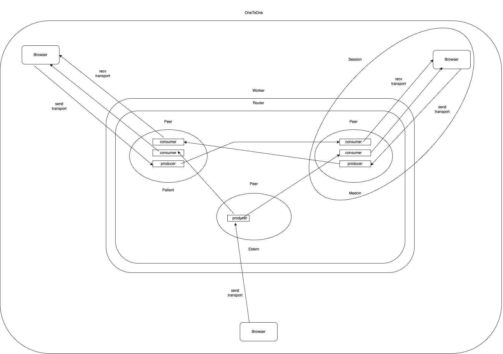
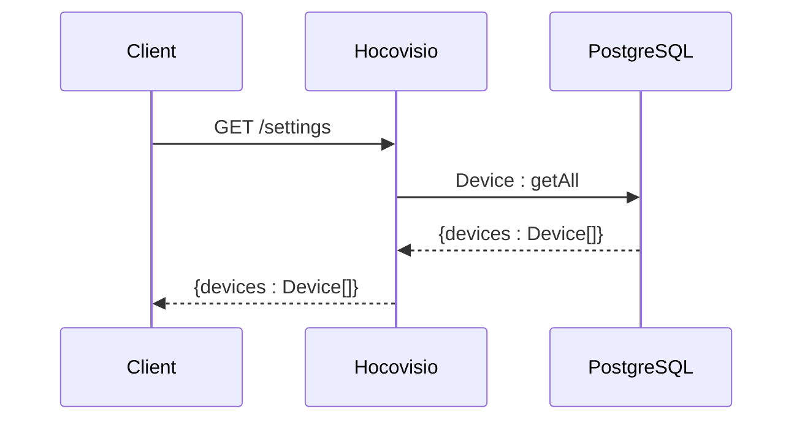
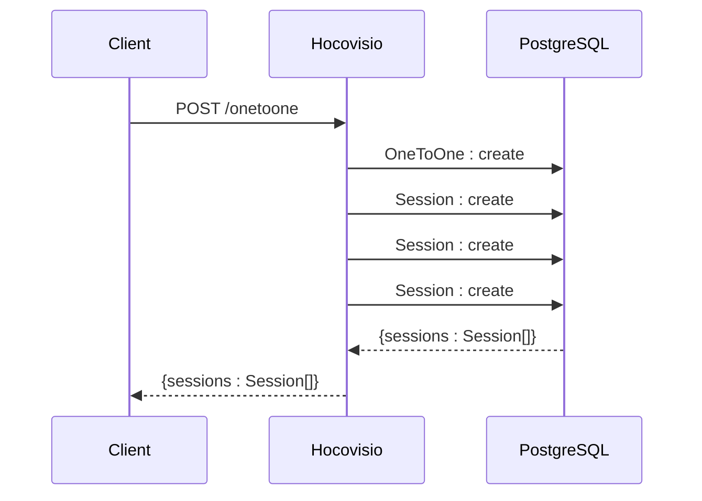
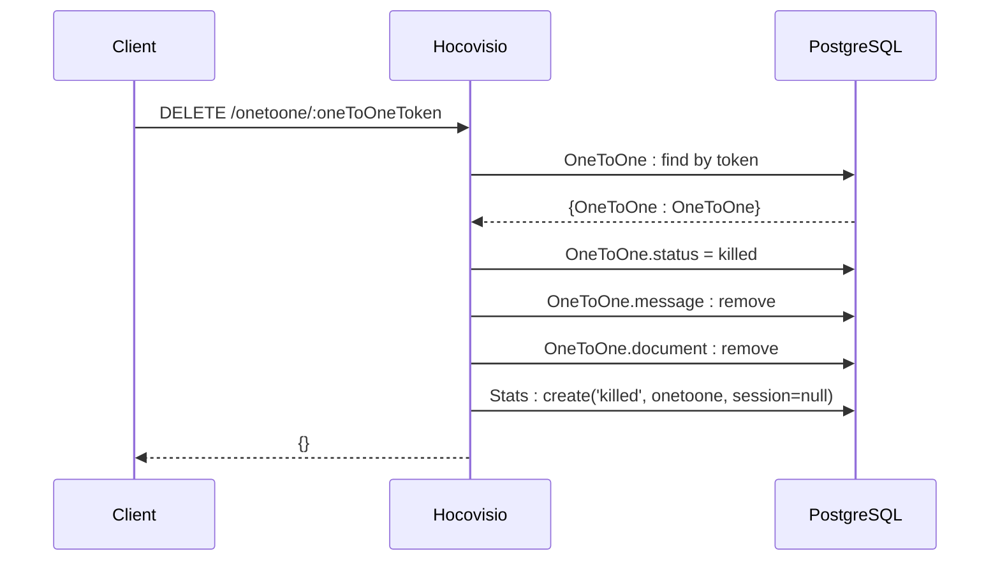
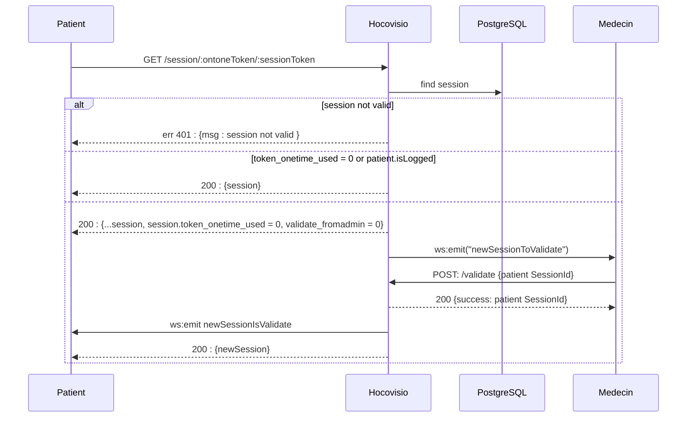
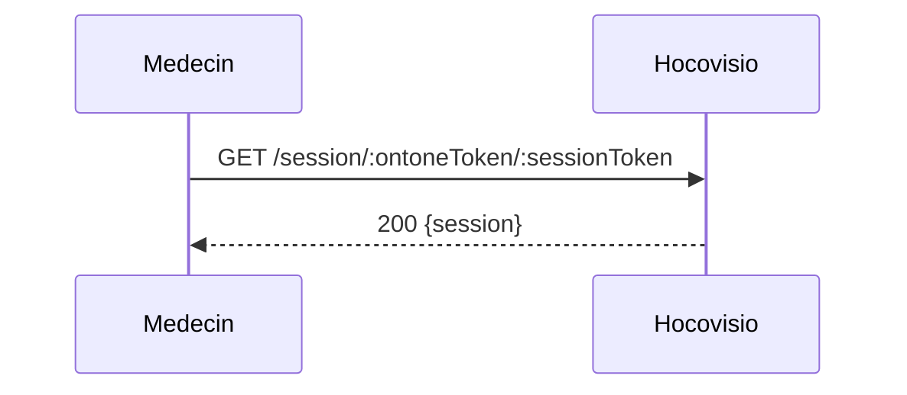
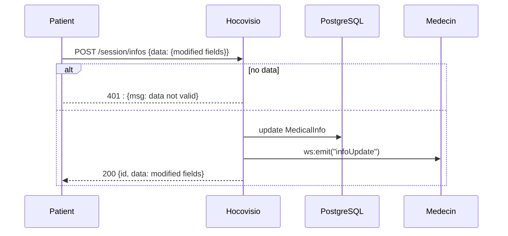
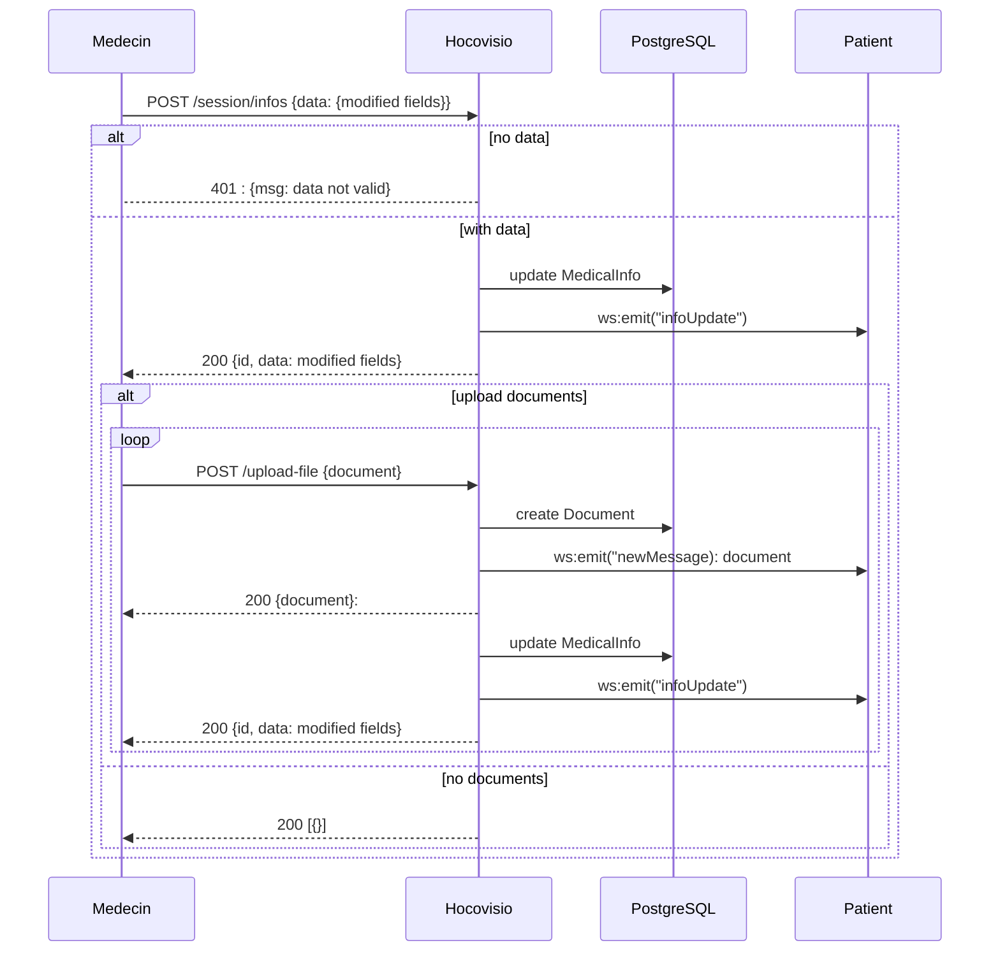

# HOCOVISIO - API

## Introduction

le backend HOCOVISIO est contruit en REST utilisant à la fois HTTP et websockets.

fonctions clés :

- mediasoup est installé comme un sfu (selective forwarding unit) pour recevoir et envoyer les flux media (audio et video)
- gérer les visioconférence (onetoone) entre les patients et les medecins et autre (sessions)
- téléverser et télécharger des documents
- connecter les dispositifs médicaux

## Achitecture générale

- ./src : contient le code source
  - ./Context : contient le seul ficheir Request.js :
    c'est une classe (class Context) qui regroupe le context d'une requete (request, response, session, onetoone)
  - ./Controllers : contient les controlleurs
  - ./Entities : Contient les tables SQL (postgres)
  - ./Factory : c'est une classe qui centralise les repositories, services, routes et controlleurs. elle aussi getController(name) qui initialize un controlleur
  - ./Repositories : contient les repositories crées par Typeorm nativement en ajoutant des méthodes spécifiques à notre usage
  - ./Routes : les routes (endpoints REST)
  - ./Services :
    - ./Documents/Uploader.js : librairie multer pour gérer les téléversements des fichiers
    - ./Monitor/Monitor.js : est une classe pour marquer les visioconférences (onetoone) comme killed ou les supprimer à partir d'une date précise
    - ./sfu : module qui contient le code mediasoup

## Architecture du SFU (mediasoup)

## Architecture de la base données

## Diagramme de séquence

Action : la première visite de l'application

Action : Create session

Action : destroy this session

Action : ouvrir la session du patient

Action : ouvrir la session du medecin

Action : Remplir le questionnaire médical

Action : Remplir le formulaire medecin

